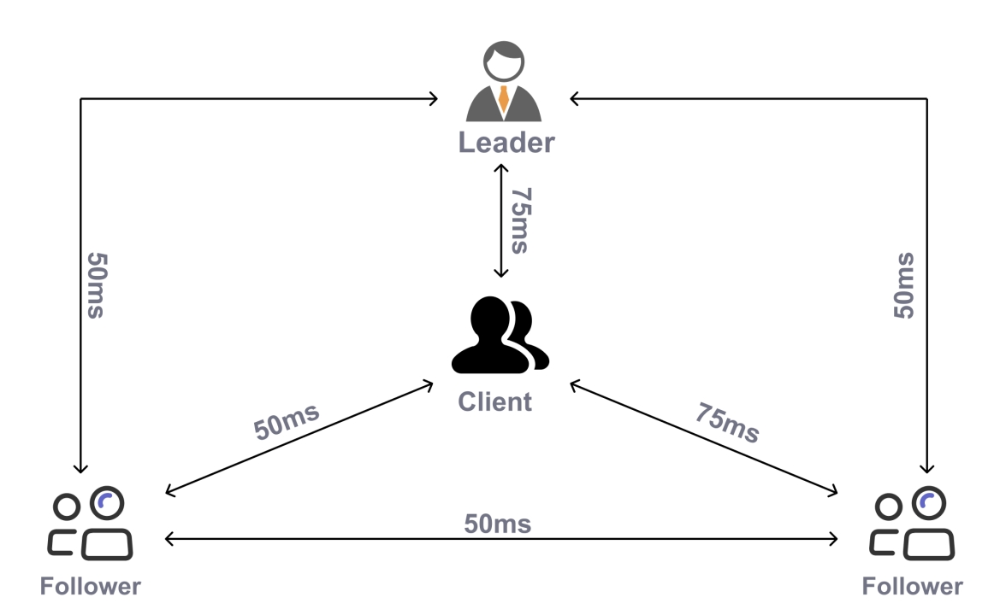
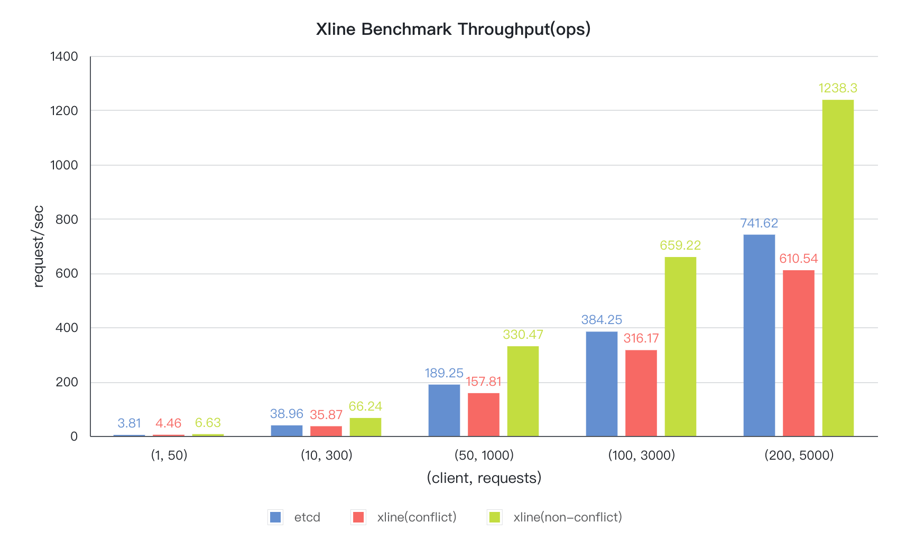

# Xline

[][discord-url]
[![Apache 2.0 licensed][apache-badge]][apache-url]
[![Build Status][actions-badge]][actions-url]
[][cov-url]

[discord-url]: https://discord.gg/hqDRtYkWzm
[apache-badge]: https://img.shields.io/badge/license-Apache--2.0-brightgreen
[apache-url]: https://github.com/datenlord/Xline/blob/master/LICENSE
[actions-badge]: https://github.com/datenlord/xline/actions/workflows/ci.yml/badge.svg?branch=master
[actions-url]: https://github.com/datenlord/xline/actions
[cov-url]: https://codecov.io/gh/datenlord/xline

`Xline` is a geo-distributed KV store for metadata management. It provides the
following features:

- Etcd compatible API.
- Geo-distributed friendly deployment.
- Compatible with K8s.

## Motivation

With the wide adoption of cloud computing, multi-cloud has become the mainstream IT architecture for enterprise customers.
Multi-cloud (or similarly multi-datacenter), however, obstacles data access across different cloud (or data center) providers to some extent.
Further, data isolation and data fragmentation resulting from cloud barriers have become
impediments to business growth. The biggest challenge of multi-datacenter
architecture is how to maintain **strong data consistency** and ensure **high
performance** in the race condition of multi-datacenter scenario.
Traditional single datacenter solutions cannot meet the
availability, performance, and consistency requirements of multi-data center
scenarios. This project targets the multi-datacenter scenario, aiming to
realize a high-performance multi-cloud metadata management solution, which is
critical for businesses with geo-distributed and multi-active
deployment requirements.

## Innovation

Cross-datacenter network latency is the most important factor that impacts the
performance of geo-distributed systems, especially when a consensus protocol is
used. We know consensus protocols are popular to use to achieve high
availability. For instance, Etcd uses the [Raft](https://raft.github.io/)
protocol, which is quite popular in recently developed systems.

Although Raft is stable and easy to implement, it takes 2 RTTs to complete a
consensus request from the view of a client. One RTT takes place between the
client and the leader server, and the leader server takes another RTT to
broadcast the message to the follower servers. In a geo-distributed environment,
an RTT is quite long, varying from tens of milliseconds to hundreds of
milliseconds, so 2 RTTs are too long in such cases.

We adopt a new consensus protocol named
[CURP](https://www.usenix.org/system/files/nsdi19-park.pdf) to resolve the above
issue. Please refer to the paper for a detailed description. The main benefit of
the protocol is reducing 1 RTT when contention is not too high. As far as we
know, Xline is the first product to use CURP. For more protocol comparison, please
refer to the [blog](https://xline.cloud/#/blog/2023-01-07-CURP%20%E2%80%94%20Revisit-the-Consensus-Protocol)

## Performance Comparison

We compared Xline with Etcd in a simulated multi-cluster environment. The
details of the deployment is shown below.

We compared the performance with two different workloads. One is 1 key case, the
other is 100K key space case. Here's the test result.

It's easy to tell Xline has a better performance than Etcd in a geo-distributed
multi-cluster environment.

## Quick Start

Read the document [QUICK_START.md](doc/quick-start/README.md) for more details.

## Contribute Guide

Read the document [CONTRIBUTING.md](./CONTRIBUTING.md) for more details.

## Code of Conduct

Read the document [CODE_OF_CONDUCT.md](./CODE_OF_CONDUCT.md) for more details.

## Roadmap

- v0.1 ~ v0.2
    - Support all major ETCD APIs
    - Support configuration file
    - Pass validation tests (All the supported etcd APIs and their validation test results can be viewed in [VALIDATION_REPORT.md](./VALIDATION_REPORT.md))
- v0.3 ~ v0.5
    - Enable persistent storage
    - Enable snapshot
    - Enable cluster membership change
    - Implement a k8s operator basically
- v0.6 ~ v0.8
    - Enable to export metrics to some monitoring and alerting systems
    - Enable SSL/TLS certificates
    - Provide clients implementing in different languages, like go, python (not determined). \[Note: Although the Xline is etcd-compatible, we provide an Xline specific client SDK to users for better performance. Currently this SDK is only in Rust lang, and we plan to extend it to other languages\]

- v1.0 ~
  - Enable chaos engineering to validate the system's stability
  - Integration with other CNCF components
