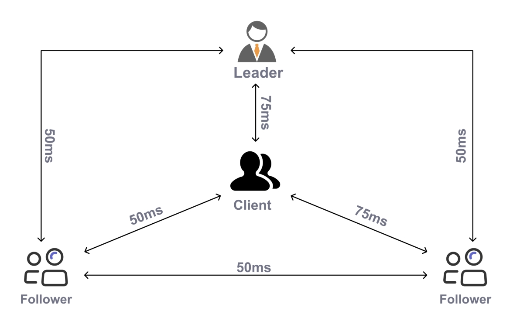
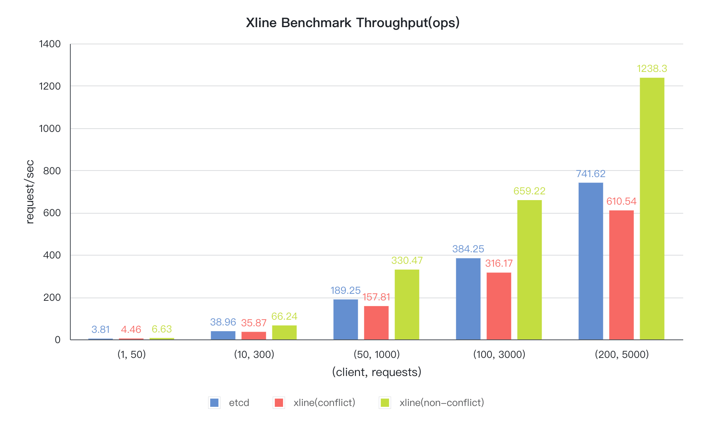

# Xline

[![Discord Shield][discord-badge]][discord-url]
[![Apache 2.0 licensed][apache-badge]][apache-url]
[![Build Status][actions-badge]][actions-url]
[![codecov][cov-badge]][cov-url]
[![OpenSSF Best Practices][openssf-badge]](openssf-url)

[discord-badge]: https://discordapp.com/api/guilds/1110584535248281760/widget.png?style=shield
[discord-url]: https://discord.gg/hqDRtYkWzm
[apache-badge]: https://img.shields.io/badge/license-Apache--2.0-brightgreen
[apache-url]: https://github.com/datenlord/Xline/blob/master/LICENSE
[actions-badge]: https://github.com/datenlord/xline/actions/workflows/ci.yml/badge.svg?branch=master
[actions-url]: https://github.com/datenlord/xline/actions
[cov-badge]: https://codecov.io/gh/xline-kv/xline/branch/master/graph/badge.svg
[cov-url]: https://codecov.io/gh/xline-kv/xline
[openssf-badge]: https://bestpractices.coreinfrastructure.org/projects/7571/badge
[openssf-url]: https://bestpractices.coreinfrastructure.org/projects/7571

Welcome to the Xline Project!

`Xline` is meant to provide high-performance, strongly consistent metadata management for data centers in WAN.

## Scope
At a high level, we expect the scope of Xline to be restricted to the following functionalities:
- Cloud-native, compatible with the Kubernetes ecosystem.
- Support geo-distributed friendly deployment.
- Supports a rich set of key-value (KV) interfaces, fully compatible with etcd's API.
- Ensures high performance and strong consistency in a wide-area network environment, using the CURP protocol as the underlying consensus protocol.

Xline is a sandbox project of the [Cloud Native Computing Foundation](https://cncf.io/) (CNCF).

If you have any questions, suggestions, or would like to join the xline's discussions, please feel free to join our [Discord channel][discord-url].

## Motivation

With the widespread adoption of cloud computing, multi-cloud platforms (multiple public or hybrid clouds) have become the mainstream IT architecture for enterprise customers. However, multi-cloud platform architecture hinders data access between different clouds to some extent.

In addition, data isolation and data fragmentation due to cloud barriers have become obstacles to business growth. The biggest challenge of multi-cloud architectures is how to maintain strong data consistency and ensure high performance in the competitive conditions of multi-data center scenarios. Traditional single data center solutions cannot meet the availability, performance, and consistency requirements of multi-data center scenarios.

This project aims to enable a high-performance multi-cloud metadata management solution for multi-cloud scenarios, which is critical for organizations with geo-distributed and multi-active deployment requirements.

## Innovation

Cross-datacenter network latency is the most important factor that impacts the
performance of geo-distributed systems, especially when a consensus protocol is
used. We know consensus protocols are popular to use to achieve high
availability. For instance, Etcd uses the [Raft](https://raft.github.io/)
protocol, which is quite popular in recently developed systems.

Although Raft is stable and easy to implement, it takes 2 RTTs to complete a
consensus request from the view of a client. One RTT takes place between the
client and the leader server, and the leader server takes another RTT to
broadcast the message to the follower servers. In a geo-distributed environment,
an RTT is quite long, varying from tens of milliseconds to hundreds of
milliseconds, so 2 RTTs are too long in such cases.

We adopt a new consensus protocol named
[CURP](https://www.usenix.org/system/files/nsdi19-park.pdf) to resolve the above
issue. Please refer to the paper for a detailed description. The main benefit of
the protocol is reducing 1 RTT when contention is not too high. As far as we
know, Xline is the first product to use CURP. For more protocol comparison, please
refer to the [blog](https://datenlord.github.io/xline-home/#/blog/2023-01-07-Curp:-Revisit-the-Consensus-Protocol)

## Performance Comparison

We compared Xline with Etcd in a simulated multi-cluster environment. The
details of the deployment is shown below.

We compared the performance with two different workloads. One is 1 key case, the
other is 100K key space case. Here's the test result.

It's easy to tell Xline has a better performance than Etcd in a geo-distributed
multi-cluster environment.

## Xline client

For more information about the Xline client SDK, or the Xline client command line tool, please refer to the following documents:

* [Xline client sdk](xline-client/README.md)
* [xlinectl](xlinectl/README.md)

## Quick Start

To get started, check out the document [QUICK_START.md](doc/quick-start/README.md) for in-depth information and step-by-step instructions.

## Contribute Guide

Our project welcomes contributions from any member of our community. To get started contributing, please see our [CONTRIBUTING.md](./CONTRIBUTING.md).

## Code of Conduct

The Xline project adheres to [the CNCF Community Code of Conduct](./CODE_OF_CONDUCT.md) . It describes the minimum behavior expected from all contributors.

## Roadmap

- v0.1 ~ v0.2
    - Support all major Etcd APIs
    - Support configuration file
    - Pass validation tests (All the supported Etcd APIs and their validation test results can be viewed in [VALIDATION_REPORT.md](./VALIDATION_REPORT.md))
- v0.3 ~ v0.5
    - Enable persistent storage
    - Enable snapshot
    - Enable cluster membership change
    - Implement a k8s operator basically
- v0.6 ~ v0.8
    - Enable to export metrics to some monitoring and alerting systems
    - Enable SSL/TLS certificates
    - Provide clients implementing in different languages, like go, python (not determined). \[Note: Although the Xline is etcd-compatible, we provide an Xline specific client SDK to users for better performance. Currently this SDK is only in Rust lang, and we plan to extend it to other languages\]

- v1.0 ~
  - Enable chaos engineering to validate the system's stability
  - Integration with other CNCF components
  - Support Karmada (a Kubernetes management system)
