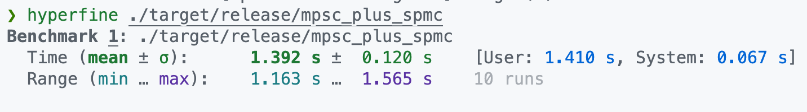
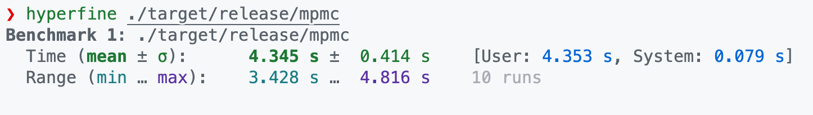
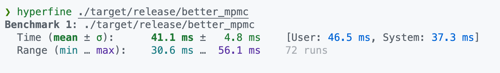

# The optimization of spmc key based channel

## Bottlenecks

The key based channel has two critical bottlenecks:

1. Locking: Currently, we use a big Mutex to protect internal structures, which can be quite inefficient when the contention is high. We should look for a lock-free solution.
2. Algorithm: Currently, we use a dependency graph to maintain the order of key based messages. When a msg is inserted, we will iterate through all uncompleted msgs(have not been marked done yet). The msg will be inserted to the buffer as the successor of another msg if there is conflict. However, the iteration will be time-consuming if the number of uncompleted msgs is high. Thus, instead of iterating through all uncompleted msgs, we should build an index to accelerate the lookup; i.e., store each key's uncompleted msgs.

## Optimize 1: use channel instead of mutex

Many excellent channel implementations(e.g., crossbeam, flume, and tokio's mpsc) achieve superb performance by adopting sophisticated optimizing techniques. We can leverage channels to do away with locks in our implementation.

### Benchmark code

```rust
use std::{iter, time::Duration};
use tokio::task::JoinHandle;

use mpmc::better_key_mpmc::{self, KeyBasedMessage};

const N_MSG_PER_SENDER: usize = 10000;
const SENDER_CNT: usize = 2;
const RECEIVER_CNT: usize = 4;

#[tokio::main(flavor = "multi_thread")]
async fn main() {
    let (senders, receivers) = {
        let (tx, rx) = better_key_mpmc::channel::<String, String>();
        let senders: Vec<JoinHandle<()>> = iter::repeat(tx)
            .take(SENDER_CNT)
            .enumerate()
            .map(|(t, tx)| {
                tokio::spawn(async move {
                    // let mut rng = thread_rng();
                    let start = t * N_MSG_PER_SENDER;
                    let end = t * N_MSG_PER_SENDER + N_MSG_PER_SENDER;
                    (start..end).for_each(|i| {
                        let msg = KeyBasedMessage::new(vec![i.to_string()], i.to_string());
                        tx.send(msg).unwrap()
                    })
                })
            })
            .collect();

        let receivers: Vec<JoinHandle<usize>> = iter::repeat(rx)
            .take(RECEIVER_CNT)
            .map(|rx| {
                tokio::spawn(async move {
                    let mut sum = 0;

                    while let Ok(Ok((id, _msg, done))) =
                        // I add a timeout here so that the receiver can stop automatically
                        tokio::time::timeout(Duration::from_millis(10), rx.recv_async())
                            .await
                    {
                        // while let Ok((id, _msg, done)) = rx.recv_async().await {
                        done.send(id).unwrap();
                        sum += 1;
                    }
                    sum
                })
            })
            .collect();
        (senders, receivers)
    };

    for handle in senders {
        handle.await.unwrap();
    }
    let mut sum = 0;
    for handle in receivers {
        sum += handle.await.unwrap();
    }
    assert_eq!(sum, SENDER_CNT * N_MSG_PER_SENDER);
}
```

### Benchmark results

tokio mpsc + key based spmc:


key based mpmc:


single-thread key filter + flume channel:

The result should be even better in practice because in `better_mpmc`, I had to add an additional timeout for the channel to stop.
