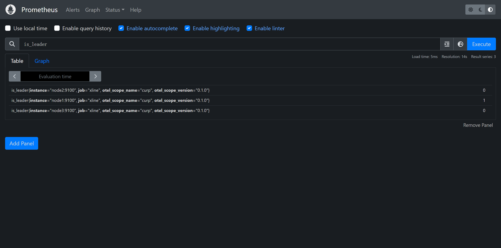

# Quick Start

## Single node cluster

### Using docker

```bash
# Assume that docker engine environment is installed.

$ docker run -it --rm --name=xline -e RUST_LOG=xline=debug -p 2379:2379 ghcr.io/xline-kv/xline \
    xline \
    --name xline \
    --storage-engine rocksdb \
    --members xline=127.0.0.1:2379 \
    --data-dir /usr/local/xline/data-dir \
    --client-listen-urls http://0.0.0.0:2379 \
    --peer-listen-urls http://0.0.0.0:2380 \
    --client-advertise-urls http://127.0.0.1:2379 \
    --peer-advertise-urls http://127.0.0.1:2380
```

```bash
# Try with etcdctl

$ ETCDCTL_API=3 etcdctl put A 1
OK
$ ETCDCTL_API=3 etcdctl get A
A
1
```

### Build from source

1. Install dependencies

```bash
# Ubuntu/Debian

$ sudo apt-get install -y autoconf autogen libtool

# Requires protobuf-compiler >= 3.15
$ git clone --branch v3.21.12 --recurse-submodules https://github.com/protocolbuffers/protobuf
$ cd protobuf
$ ./autogen.sh
$ ./configure
$ make -j$(nproc)
$ sudo make install
```

```bash
# macOS

# Assume that brew is installed, or you could install brew by:
# /bin/bash -c "$(curl -fsSL https://raw.githubusercontent.com/Homebrew/install/HEAD/install.sh)"

$ brew install protobuf
```

2. Build xline

```bash
# Assume that rust compile environment installed, such as cargo, etc.

# clone source code
$ git clone --recurse-submodules https://github.com/xline-kv/Xline

# compile Xline
$ cd Xline
$ cargo build --release
```

3. Run xline

```bash
$ ./target/release/xline --name xline \
  --storage-engine rocksdb \
  --members xline=127.0.0.1:2379 \
  --data-dir <path-to-data-dir> \
  --client-listen-urls http://0.0.0.0:2379 \
  --peer-listen-urls http://0.0.0.0:2380 \
  --client-advertise-urls http://127.0.0.1:2379 \
  --peer-advertise-urls http://127.0.0.1:2380
```

## Standard xline cluster

1. Start the cluster

```bash
# Pull the latest image from ghcr.io
$ docker pull ghcr.io/xline-kv/xline:latest
# Copy some fixtures which are required by quick_start.sh
$ cp fixtures/{private,public}.pem scripts/
# Using the quick start scripts
$ ./scripts/quick_start.sh
```

2. Basic requests

```bash
# Set Key A's value to 1
$ docker exec client /bin/sh -c "/usr/local/bin/etcdctl --endpoints=\"http://node1:2379\" put A 1"
OK

# Get Key A's value
$ docker exec client /bin/sh -c "/usr/local/bin/etcdctl --endpoints=\"http://node1:2379\" get A"
A
1
```

3. Inspect metrics

After finished `Start the cluster`, you can goto http://127.0.0.1:9090/graph.
You should be able to see a web ui of Prometheus.

For example:

This means the `node1` is the leader.



For more metrics, please goto [metrics.md](./metrics.md)

4. Benchmark

```bash
$ ./scripts/quick_start.sh stop
$ ./scripts/benchmark.sh xline
```

5. Membership Change
```bash
# Before member add
$ docker exec client /bin/sh -c "/usr/local/bin/etcdctl --endpoints=\"http://172.20.0.3:2379\" member list -w table"
+------------------+---------+-------+---------------------------------+------------------------+------------+
|        ID        | STATUS  | NAME  |           PEER ADDRS            |      CLIENT ADDRS      | IS LEARNER |
+------------------+---------+-------+---------------------------------+------------------------+------------+
| e17dd71c0e2c6d1e | started | node3 | 172.20.0.5:2380,172.20.0.5:2381 | http://172.20.0.5:2379 |      false |
| f724bbce9f9988f6 | started | node1 | 172.20.0.3:2380,172.20.0.3:2381 | http://172.20.0.3:2379 |      false |
| 2bd3a73819298fd6 | started | node2 | 172.20.0.4:2380,172.20.0.4:2381 | http://172.20.0.4:2379 |      false |
+------------------+---------+-------+---------------------------------+------------------------+------------+

# do the member add
$ docker exec client /bin/sh -c "/usr/local/bin/etcdctl --endpoints=\"http://172.20.0.3:2379\" member add node4 --peer-urls=http://172.20.0.17:2380,http://172.20.0.17:2381"
Member 343900f0eec03419 added to cluster 425b5b944b259215

ETCD_NAME="node4"
ETCD_INITIAL_CLUSTER="node1=172.20.0.3:2380,node1=172.20.0.3:2381,node2=172.20.0.4:2380,node2=172.20.0.4:2381,node3=172.20.0.5:2380,node3=172.20.0.5:2381,node4=http://172.20.0.17:2380,node4=http://172.20.0.17:2381"
ETCD_INITIAL_ADVERTISE_PEER_URLS="http://172.20.0.17:2380,http://172.20.0.17:2381"
ETCD_INITIAL_CLUSTER_STATE="existing"

# boot up a new node
$ cd Xline
$ docker run -d -it --rm --name=node4 --net=xline_net --ip=172.20.0.17 --cap-add=NET_ADMIN --cpu-shares=1024 -m=512M -v ./scripts:/mnt ghcr.io/xline-kv/xline:latest bash
c770844093d34ed0bf0258c85d8a7efb10d32b8b3a8127f38d90b1d454087fd6

$ docker exec -e RUST_LOG=debug -d node4 /usr/local/bin/xline --name node4 --members node1=172.20.0.3:2380,172.20.0.3:2381,node2=172.20.0.4:2380,172.20.0.4:2381,node3=172.20.0.5:2380,172.20.0.5:2381,node4=172.20.0.17:2380,172.20.0.17:2381 --storage-engine rocksdb --data-dir /usr/local/xline/data-dir --auth-public-key /mnt/public.pem --auth-private-key /mnt/private.pem --client-listen-urls=http://172.20.0.17:2379  --peer-listen-urls=http://172.20.0.17:2380,http://172.20.0.17:2381 --client-advertise-urls=http://172.20.0.17:2379 --peer-advertise-urls=http://172.20.0.17:2380,http://172.20.0.17:2381 --initial-cluster-state=existing

# check whether the new member adding success or not
$ docker exec client /bin/sh -c "/usr/local/bin/etcdctl --endpoints=\"http://172.20.0.3:2379\" member list -w table"
+------------------+---------+-------+-------------------------------------------------+-------------------------+------------+
|        ID        | STATUS  | NAME  |                   PEER ADDRS                    |      CLIENT ADDRS       | IS LEARNER |
+------------------+---------+-------+-------------------------------------------------+-------------------------+------------+
| f724bbce9f9988f6 | started | node1 |                 172.20.0.3:2380,172.20.0.3:2381 |  http://172.20.0.3:2379 |      false |
| 2bd3a73819298fd6 | started | node2 |                 172.20.0.4:2380,172.20.0.4:2381 |  http://172.20.0.4:2379 |      false |
| e17dd71c0e2c6d1e | started | node3 |                 172.20.0.5:2380,172.20.0.5:2381 |  http://172.20.0.5:2379 |      false |
| 343900f0eec03419 | started | node4 | http://172.20.0.17:2380,http://172.20.0.17:2381 | http://172.20.0.17:2379 |      false |
+------------------+---------+-------+-------------------------------------------------+-------------------------+------------+

# do the member remove
$ docker exec client /bin/sh -c "/usr/local/bin/etcdctl --endpoints=\"http://172.20.0.3:2379\" member remove 343900f0eec03419"
Member 343900f0eec03419 removed from cluster 425b5b944b259215

# check whether the target member removed success or not
$ docker exec client /bin/sh -c "/usr/local/bin/etcdctl --endpoints=\"http://172.20.0.3:2379\" member list -w table"
+------------------+---------+-------+---------------------------------+------------------------+------------+
|        ID        | STATUS  | NAME  |           PEER ADDRS            |      CLIENT ADDRS      | IS LEARNER |
+------------------+---------+-------+---------------------------------+------------------------+------------+
| f724bbce9f9988f6 | started | node1 | 172.20.0.3:2380,172.20.0.3:2381 | http://172.20.0.3:2379 |      false |
| 2bd3a73819298fd6 | started | node2 | 172.20.0.4:2380,172.20.0.4:2381 | http://172.20.0.4:2379 |      false |
| e17dd71c0e2c6d1e | started | node3 | 172.20.0.5:2380,172.20.0.5:2381 | http://172.20.0.5:2379 |      false |
+------------------+---------+-------+---------------------------------+------------------------+------------+
```

6. Validation test

```bash
docker cp node1:/usr/local/bin/lock_client ./scripts

./scripts/validation_test.sh
```

## Directory Structure

| directory name | description                                             |
|----------------|---------------------------------------------------------|
| benchmark      | a customized benchmark using CURP protocol based client |
| curp           | the CURP protocol                                       |
| xline          | xline services                                          |
| engine         | persistent storage                                      |
| utils          | some utilities, like lock, config, etc.                 |
| scripts        | the shell scripts for env deployment or benchmarking    |
